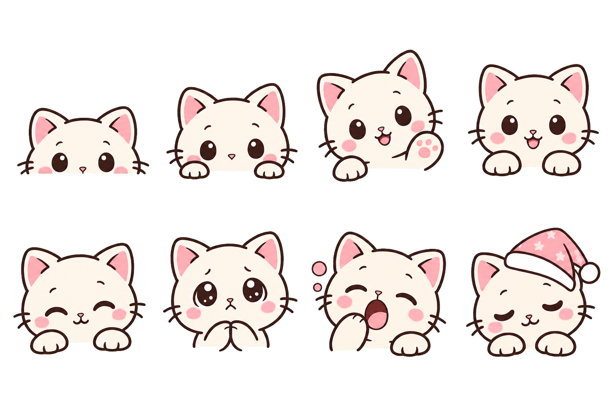

# DSH Deep Sleep

DSH Web 顶栏里的猫猫早睡提醒。每天本地时间 22:00，如果用户仍在当前 DSH 标签页活动，猫猫会从右上角慢慢探头，并用气泡提醒“要早点休息了”。继续使用时，它会逐步撒娇、犯困；用户可以稍后 15 分钟再提醒，或跳过当晚。



## 行为

| 本地时间 | 猫猫状态 | 文案 |
| --- | --- | --- |
| 22:00 起 | 探头 | 要早点休息了 |
| 22:15 起 | 轻轻催促 | 已经很晚了，收个尾就去睡吧 |
| 22:30 起 | 双爪撒娇 | 真的该休息了，明天再继续吧 |
| 23:00 起 | 戴睡帽犯困 | 小猫都困得睁不开眼了，你也该睡了 |

- 提醒窗口为本地时间 22:00（含）至次日 06:00（不含），跨午夜仍算同一晚。
- 猫猫以会话顶栏插槽作为生命周期锚点，并固定呈现在 Web 视口右上角。
- 只有页面可见、窗口有焦点，且最近 5 分钟内发生过键盘、指针、滚轮或触摸活动时才显示。
- “15 分钟后”会暂时收起；“今晚不再提醒”只跳过当前夜晚。
- 动画尊重系统的 `prefers-reduced-motion` 设置。

## 安装

已在 2026-08-13 使用 DSH `0.0.1-rc.1`（commit `2b3239872f77aabfdaa3ed6aeb8f99109b682f37`）验证 Profile Bundle 契约。需要 Node.js 22.19+ 和 pnpm。

```bash
pnpm install
pnpm run check
dsh plugin --profile web add link:/absolute/path/to/dsh-deep-sleep
dsh --profile web --dump-config
dsh web
```

这是双端 Profile Bundle：`cordis.patch.yml` 提供无副作用的 Node Loader 锚点，`package.json#dsh.client` 声明 Web 客户端入口。UI 只通过官方 `conversation.session.header.actions` 插槽注册，没有修改 DSH 核心源码。

## 隐私与权限

- 不注册模型可调用工具，不向模型或会话注入提醒消息。
- 不请求通知权限，不播放声音，不访问网络。
- 仅在浏览器 `localStorage` 的 `dsh-deep-sleep/preferences-v1` 中保存“稍后提醒”和“今晚跳过”状态。
- 时间、页面活动和窗口焦点仅在浏览器内判断，不写入服务端日志。

## 开发与验收

```bash
pnpm run typecheck
pnpm test
pnpm run build
pnpm pack
```

构建默认从 `$DSH_CHECKOUT`、`$DSH_HOME/source/current` 或 `~/.dsh/source/current` 查找当前 DSH 源码，用其 `clientBundle` 生成宿主可加载的客户端闭包。构建产物位于 `lib/`，发布包可脱离源码工作树安装运行。

猫猫原画为本项目专门生成的八格动作素材；透明 PNG 是可编辑交付稿，WebP 经脚本嵌入客户端 bundle。原始抠图中间稿保留在 `assets/source/`，运行时不包含它。
完整的生成模式、原始提示词和编辑提示词记录在 [`assets/PROMPTS.md`](assets/PROMPTS.md)。

## 项目与反馈

- Canonical source：[omdsh-dev/dsh-deep-sleep](https://github.com/omdsh-dev/dsh-deep-sleep)。
- Bug、建议与协作请求请提交到公开仓库的 [Issues](https://github.com/omdsh-dev/dsh-deep-sleep/issues)。
- `dsh-external/dsh-deep-sleep` 是维护者使用的私密镜像；公开仓库是唯一接受变更和反馈的上游，避免双向修改与版本漂移。

## 素材与商标

猫猫素材由图像生成工具为本项目专门生成，生成方式与逐字提示词均已公开记录；原始中间稿保留内容来源凭证。代码、项目原创文档以及在适用范围内的项目原创素材按 BSD-3-Clause 提供。第三方名称、标识和商标不在本项目许可范围内。

DeepSeek、DeepSeek Harness 及相关标识属于其各自权利人。本项目是社区插件，不表示 DeepSeek 或相关权利人的背书。详见 [`NOTICE.md`](NOTICE.md)。

## 已知边界

- 首版固定为 22:00—06:00 和 15 分钟 snooze，尚无设置页。
- 提醒依赖打开的 DSH Web 页面；浏览器完全关闭时不会后台唤醒。
- 全新空白页尚未挂载会话顶栏，需进入任一会话后猫猫才会出现。
- 本插件专注睡眠节律策略与猫猫交互，不另造通用调度、系统通知或桌面宠物基础设施。

## License

BSD-3-Clause
